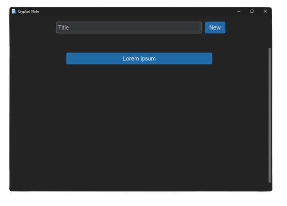
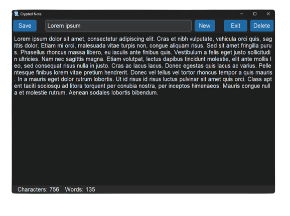

<h1 align="center">CryptedNote</h1>

  

  

<h2>An application where the user can write crypted documents made with Customtkinter Python</h2>

<h3>Requirements</h3>
<ul>
  <li>run <code>pip install -r requirements.txt</code></li>
</ul>

<h3>Description</h3>

The user creates a document with encrypted data stored in json/notes.json

<h3>Example of encrypted data</h3>
<pre>
{
    "gAAAAABj9ei3AnCgw_5Kv4p6O-sDgtCh1wKuVgxGKj-OphWvYP28xps4fh30CVIDvBDjYSy1zJ5uaPAGhAGWupiNJuhxt5busA==": "gAAAAABj9ejISTFnhNvnxCBDtVrJrUKJ-ZMFguXY2k42K9DSl-cNOKr7C62RKW3npcI-_6tF1n3OucI8xNcapZayXkhAPmDWAPho56bKl8kbUgDp0sLj6-ZJpMuEOfm8gZBF9RVgiizB7Q6Kt_uRInk7564KL6qKH2jcN7ALbmYLgGH9cKKV0KWYgywaHEWw6IMLZqeJezgYZa8yt1APu5fWa3PER5B8xQIBUcenwMFzqdp0YqEhtMcnrQkPavVzMru1Os5aedABsXaLp0RfYB0LBofIhNl6XLoK_vInQ1ysAXKa9ZnvQy6I7FyKwimcD8rxv3uMqHIOBH77q04KMAUiFT-laVSapGQkeXX0gbehgn3aC_Iwr0rQx38dr778CO1c6usQkfExHxPUWLKpZlymLflMoQI1VC-M48Kpfmsxek1ao0gjKaPXtmvFiryq1dciTqMyiU8fwDBFUm-bOuNf463Azsw2wNo-OlGOnR63mRt9nxdgBdC5ckvLCbZfuLKWDKw4ZZpkD1aybtmoBhtvYD9e8GZZFCkWrY5zUqTuUOeBYgxS3COBMSwFTzevdkEnlvZMdIbsotcXNInbY-LxEXOggCgBmnjJKV0kuuv4u2Ix98GgNKiTrePDcrnFJcBtgYBOLo_1Rq2y3MNWxYMxXDn-WqOdTwZaY7_DTVHrfV3EQc_yX_QyP-KtrmhNVG4HCWJHCoWMCEOTXcm9KnUVp2tLwUbS4uE_Ew7jaB7uCW7iLMtBGrqj_8hObAnPWI268J1q--pSDS1NFTgSg_1_cgKfJX-IYL6eI_1dpbOybB2Z8EcGOC9NvW067zY7Mv2PQCW8N73IM3rMlOHDi-RxGdI-W-y-hYDVtiwlElPUWVtl1_HL6tPlzSZSa8KxmLuQ8qjdWxmz2uugjEDcCTdE6a_atOjra-FYWnJoUlbbkzuwZuglK_mL_19e7p5F43F8KvZU8KsQJDpI2n35m99AQx0aSgQt7vgdgyIpG7OGCmLoiK96VQw1UaUx_n1Gu7sUGm_6CJHlXMicgU1UuI0eVvHy8oYEFek7GS_FoyqPRc5df27rMoIv7NEjsgkEuvcjyJ-KkrXtlqmQlzcJUt4SnrI9KabwBsEaoZmJGGmV0Kz8tPEKN6g2mc_-zZ8FjDJMmegV4MxmgPgami6svllwtUByD58wJe33L8He5II726D0yFNxE1H_90TP08oqktRzarlKBVG6PeSWRa_8Y_xESAZQladRco3px6XoUaqr43XcgktQEXI="
}
</pre>
